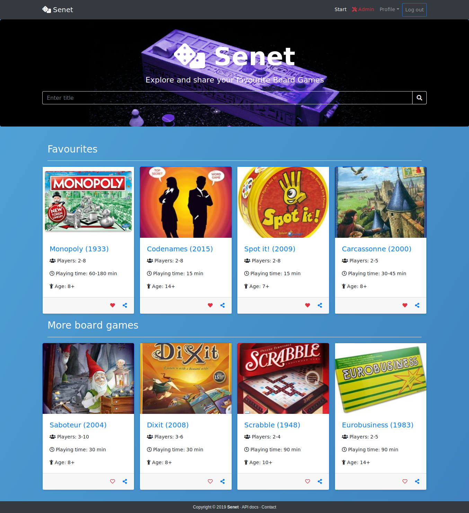

# BoardGames_Spring
"Senet Board Games" application that provides a possibility for their users to explore, like and share their favourite board games. Project made using Spring technology stack, along with REST API and Bootstrap interface.<br/>
Functionality includes i.a. registering new account, signing in system, updating account info with changing the password, admin panel to control user accounts and board games (CRUD), exploring and sharing board games.

### Stack of technologies
* Spring: Boot, Framework (MVC, DI), Data (Hibernate), Security
* Web: Bootstrap
* Tests: JUnit Jupiter

## Live demo
Application is available @ Heroku:
* [Senet Board Games app](https://senetbg.herokuapp.com/)

## Index view of Senet app


## How to run the application
The project includes Spring Boot Maven Plugin, so using this command will build and run the application:
```
mvn spring-boot:run
```
Application properties are available under the file `application.properties` which is needed to change the credentials and host of provided database.

### Credentials
Login to admin account using:
* E-mail: admin@gmail.com
* Password: admin