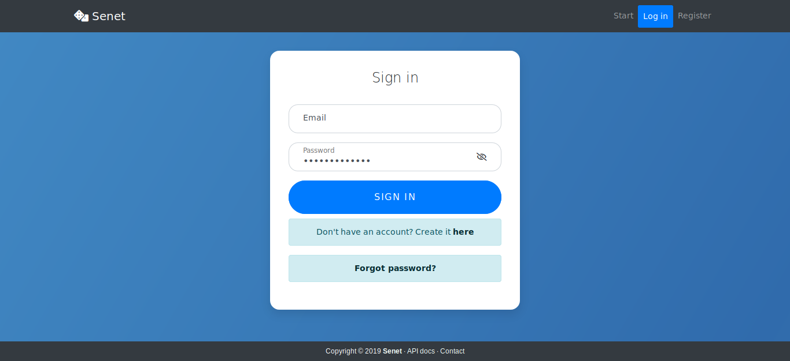

# BoardGames_Spring
Board games application made using Spring and Hibernate frameworks with the Spring Security login system, contains user and admin panel. The web part uses Spring MVC and REST API, Bootstrap user interface.

### Live preview
* [SpringPortal app](https://springportal.herokuapp.com/)

### Login page
